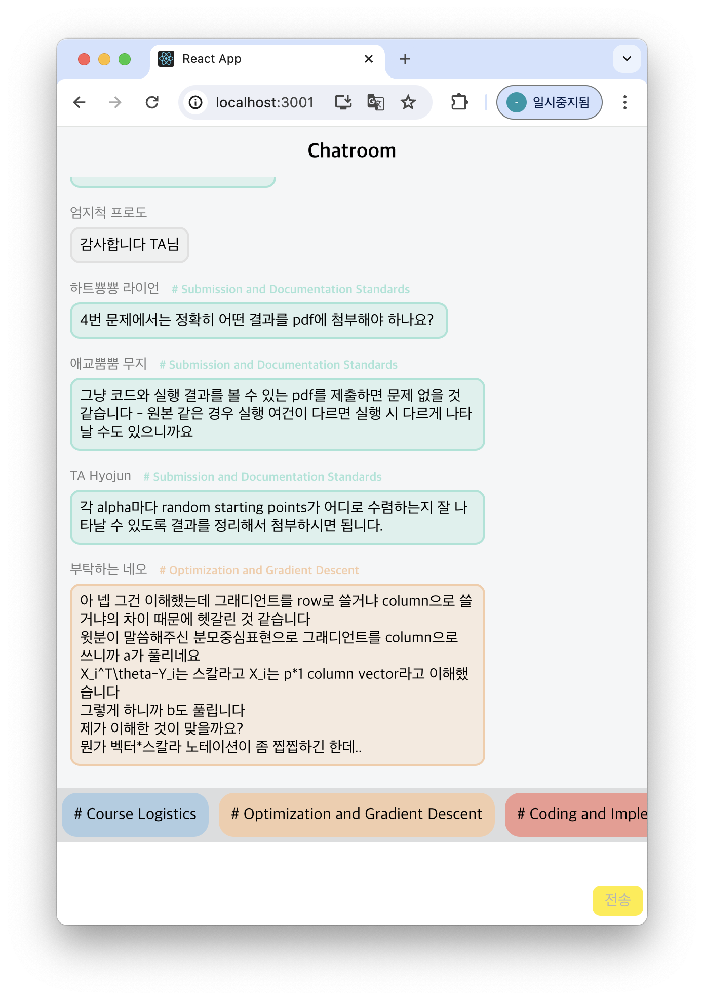
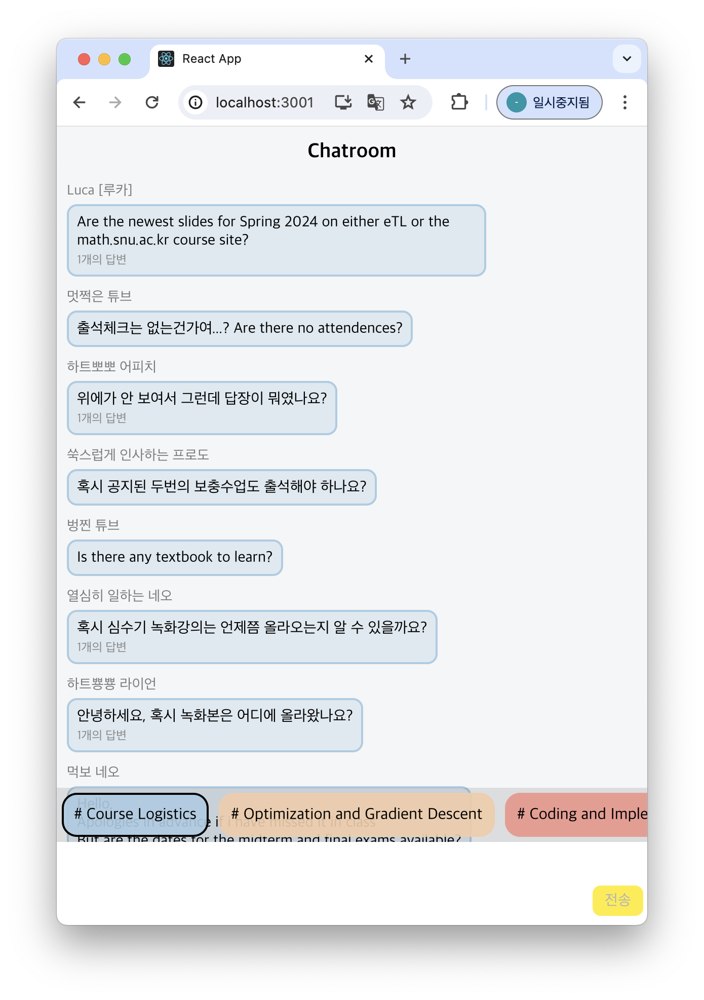
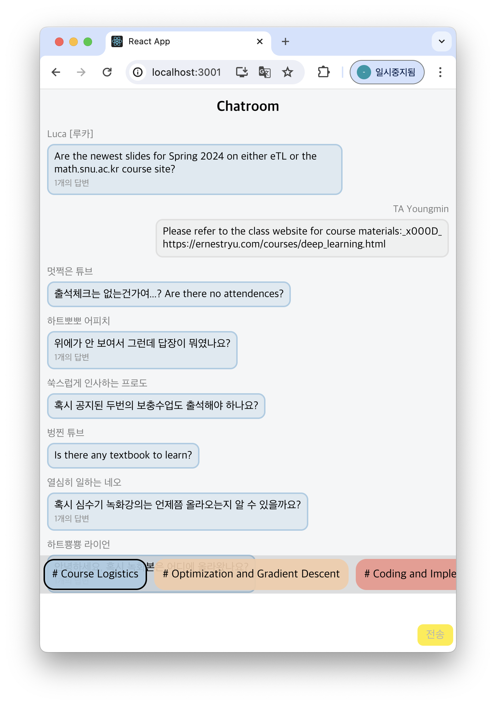

# 🎯 Question-Answer-and-Connect
## 📚 Introduction
This repository contains the implementation of a Human-Computer Interaction course project, Question-Answer-and-Connect. This prototype runs in the Web browser. It is implemented using React with Javascript language. 

## 🧩 What does this application do?
This app Connects Questions and Answers. 🗣️💬

At first glance, it may look like a regular chat window, but do you see the keywords above the input field? When you select a keyword, it gathers related Questions, and when you select a Question, it allows you to see related Answers and follow-up questions.

If you enter a new chat, it will be classified under a keyword in a short time, or a new keyword will be added.

<p float="left">
    
     
    
</p>

## 🚀 Run it yourself!
Clone this repository and move to the directory:
```bash
git clone https://github.com/ZzeongB/Question-Answer-and-Connect.git
cd Question-Answer-and-Connect/
```

If it is your first time, run the command below to install requirements:
```bash
yarn install
```

Also, to use OpenAI functions, you need to get an API key. Once you have the key, you need to add it to your environment variables. Here's how you can do it:

1. Create a new file in the root directory of the project and name it `.env`.

2. Open the `.env` file and add the following line:

    ```
    REACT_APP_OPENAI_API_KEY=Your_OpenAI_Key
    ```

    Replace `Your_OpenAI_Key` with the key you received.

You need to run two commands in two terminals, one in each.
Run the following commands for demo:
```bash
yarn json-server <database> # to import data

# open a new terminal, and
yarn start # to run application
# It will ask like 'Would you like to run the app on another port instead?'
# Press 'y'
```
First command will make the database run in port 3000, and second command will run application in port 3001. If you cannot see the screen, manually open `http://localhost:3001` in the browser.


We provde you with example dataset: `shimsugi_final.json`. You can use it by running:
```bash
yarn json-server shimsugi_final.json # import data

# open a new terminal, and
yarn start # to run application
```
You can use the example we provided, or create your own dataset. 📊
